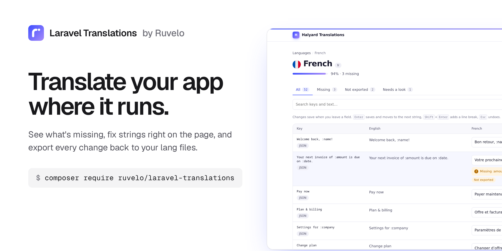
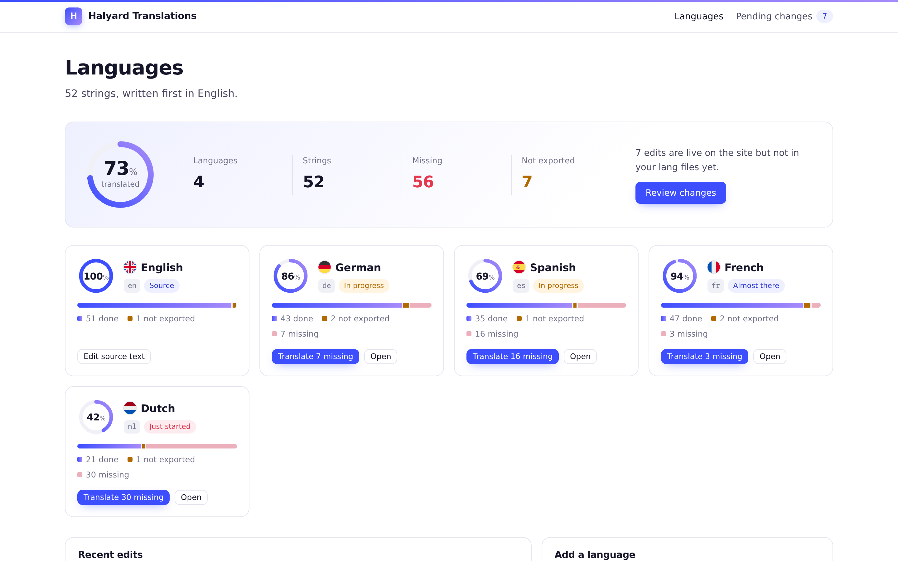
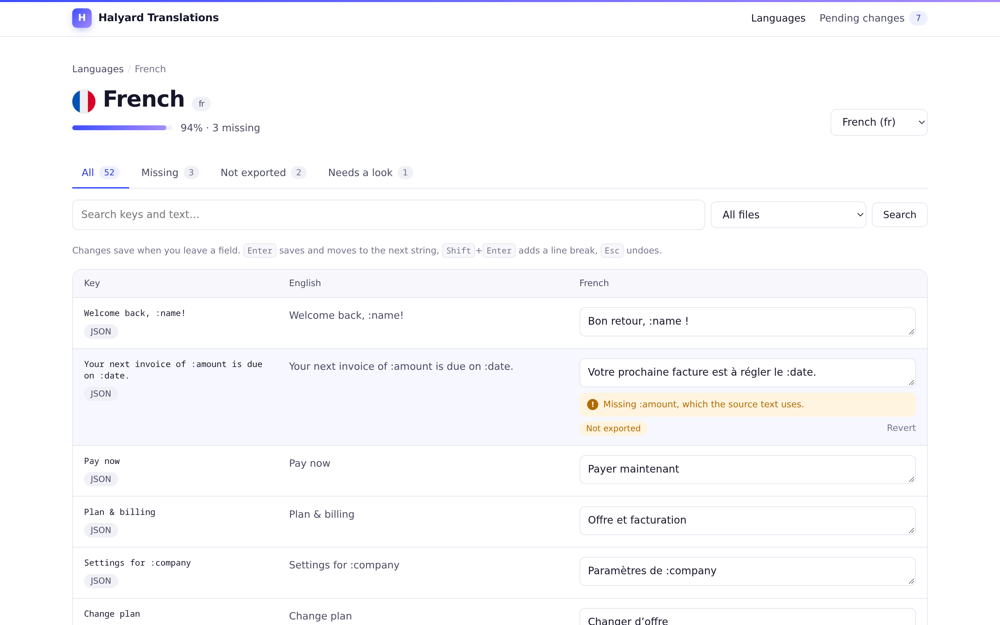
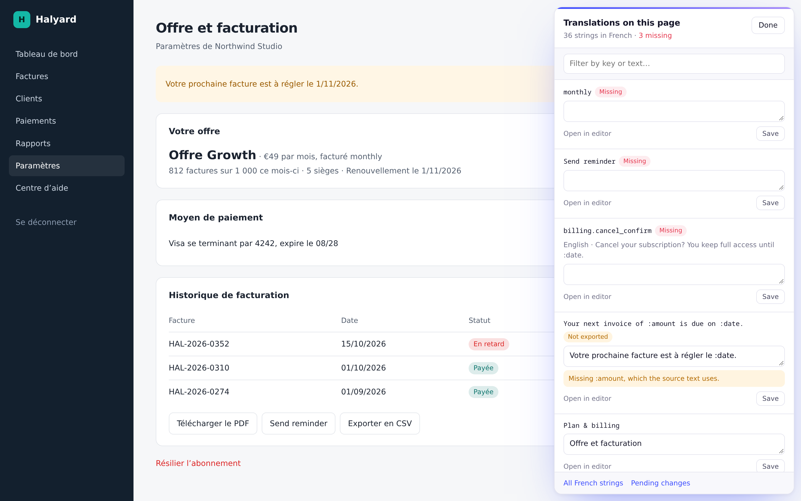
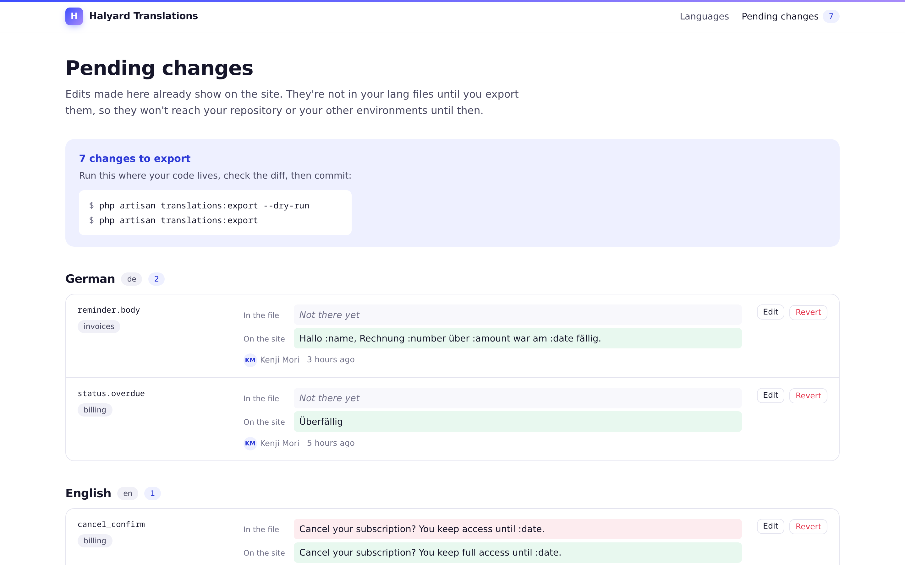
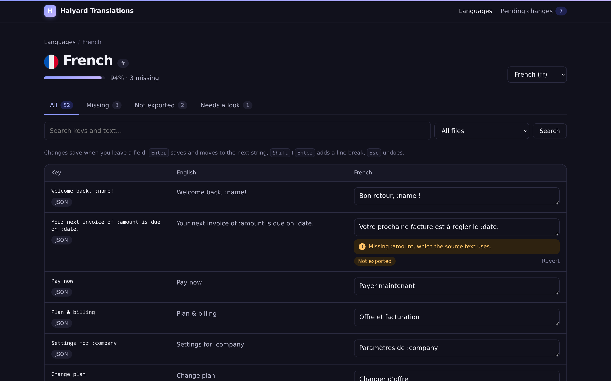
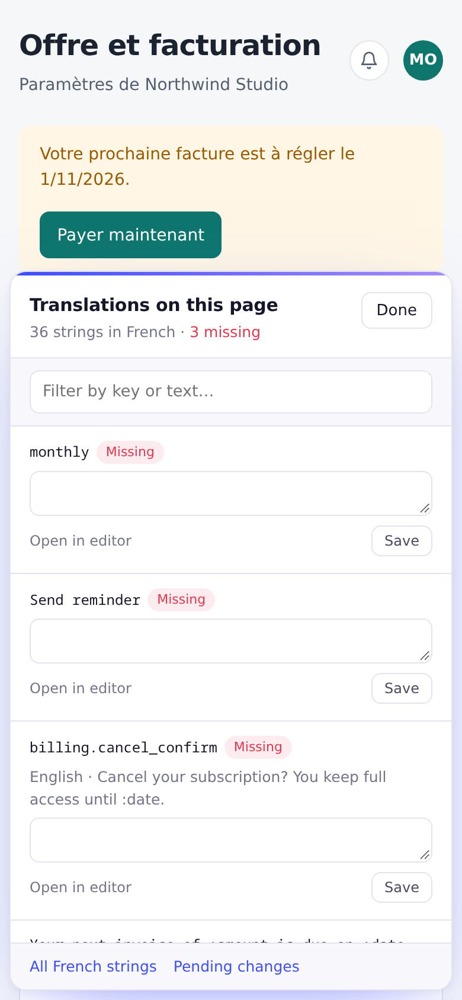

<p align="center">
  <a href="https://ruvelo.github.io/laravel-translations/"></a>
</p>

<p align="center">
  <a href="https://ruvelo.github.io/laravel-translations/"><strong>Live demo</strong></a> &nbsp;&nbsp;&nbsp;
  <a href="#configuration"><strong>Configuration</strong></a> &nbsp;&nbsp;&nbsp;
  <a href="#for-developers"><strong>Developer guide</strong></a> &nbsp;&nbsp;&nbsp;
  <a href="CHANGELOG.md"><strong>Changelog</strong></a>
</p>

<p align="center">
  <a href="https://github.com/Ruvelo/laravel-translations/actions/workflows/tests.yml"></a>
  
  
  
  
  <a href="LICENSE"></a>
</p>

# Laravel Translations

**A translation manager for your Laravel app.** See how far each language has got, fill in what's missing in a fast editor, or turn on edit mode and fix the strings right on the page where you see them. Your `lang/` files stay the source of truth: edits go live at once, and one command writes them back into the files so you can commit them.

```
composer require ruvelo/laravel-translations
php artisan migrate
```

Then let someone in, for example in your `AppServiceProvider`: `Gate::define('translations-edit', fn ($user) => $user->is_admin);` and open `/translations`. Or click around the [live demo](https://ruvelo.github.io/laravel-translations/) first.

**No dependencies beyond `laravel/framework`.** Translation packages run inside every request of your app, and after the 2026 supply-chain attack on `laravel-lang` release tags, fewer packages in that path is a feature. This one installs nothing else. Machine suggestions use the Laravel AI SDK only if you already have it.

## A quick tour



**See where every language stands.** Each language shows how much is translated, what's missing and what hasn't been exported yet.



**Translate in a fast table.** Key, source text and translation side by side. Changes save when you leave a field, Enter moves to the next string, and a warning shows the moment a translation drops a placeholder like `:amount` or a plural form.



**Fix text where you see it.** Turn on *Edit translations* on any page of your app. A panel lists every string that page used, missing ones first, each ready to edit. Save, and the page shows the new text.



**Review before you commit.** Every edit not yet in your lang files, with what the file says, what the site shows, who changed it and when. Revert any of them in a click, then run `php artisan translations:export`.

<table>
  <tr>
    <td width="62%"></td>
    <td width="38%"></td>
  </tr>
  <tr>
    <td><strong>Light and dark</strong>, following each editor's system setting.</td>
    <td><strong>Works on a phone</strong>, panel and all.</td>
  </tr>
</table>

## Features

- **Your lang files stay in charge.** PHP files (nested keys, sub-folders, `lang/vendor/{package}`) and JSON files are read as Laravel reads them. Edits are stored as overrides and laid over Laravel's own loader, so they apply instantly in production without writing to the server's filesystem.
- **Export back to the files.** `translations:export` edits the files in place: changed strings are swapped where they stand, new keys slot in next to their neighbour in the source language, and comments, quotes and alignment survive. `--dry-run` shows the diff.
- **Edit in context.** A small "Edit translations" button for editors only, injected into your pages (or placed with `<x-translations::toolbar />`). It records which keys the page used and lists them in a side panel. Nothing is wrapped in markup, so attributes, titles and buttons are covered and nothing breaks.
- **Placeholder checks.** `:name` (any case), `{count}`, plural forms separated by `|`, `{0}` / `[1,*]` ranges and HTML tags. Warnings show as you type and in a "Needs a look" filter.
- **Locale progress.** Percent translated, missing count and pending changes per language. Languages are detected from your lang folder, or set in config; add a new one from the overview.
- **Filters and search.** Missing, not exported or needs a look; search across keys and text; narrow to one file or package.
- **Missing key scanner.** `translations:scan` finds keys used with `__()`, `trans()`, `trans_choice()`, `@lang`, `@choice` and `Lang::get()` in PHP and Blade, and `$t()` / `t()` / `i18n.t()` in JS, TS, Vue and JSX when asked. It lists what the source language lacks, adds it with `--create`, and reports unused keys.
- **Imports.** A file back from a translator, another lang folder, or the database of barryvdh/laravel-translation-manager, all as pending changes to review.
- **Suggestions, if you want them.** With the [Laravel AI SDK](https://laravel.com/docs/ai-sdk) installed and configured, a *Suggest* button drafts a translation that keeps the placeholders. It never saves on its own.
- **Fast.** Overrides are compiled per language and file, cached, and cleared the moment one changes.
- **Safe.** Only users who pass the `translations-edit` gate get in (nobody until you define it), every value is escaped in the UI, and guests get your login page or a 403, never an error.
- **No build step, no JavaScript required.** Plain forms work everywhere; a little inline JavaScript makes them quicker. Light and dark, readable at phone width.

## Requirements

- PHP 8.3+
- Laravel 12 or 13
- Any database Laravel supports (tested on SQLite)
- Optional: `laravel/ai` for suggestions

## How it fits your workflow

1. Developers add strings to the source language's lang files, as always.
2. Translators and editors fill in the rest at `/translations`, or on the page itself. It's live straight away.
3. Someone with the code runs `php artisan translations:export --dry-run`, then `translations:export`, and commits the files. If your editors work in production, run the export there and download the files, or have a script read `GET /api/translations/changes` and apply them to a checkout.
4. After that deploy, `php artisan translations:prune` (add it to your deploy script) deletes the overrides the files now hold.

If someone changes a string in the code after it was edited in the browser, the review page flags it so nobody's work is silently lost.

## Configuration

Publish the config file if you want to change the defaults:

```
php artisan vendor:publish --tag=translations-config
```

| Key | Default | |
|---|---|---|
| `name` | `Translations` (`TRANSLATIONS_NAME`) | Shown in the header and page titles |
| `enabled` | `true` (`TRANSLATIONS_ENABLED`) | Apply overrides at runtime |
| `source_locale` | your `app.fallback_locale` | The language every other is measured against |
| `locales` | `null` | `null` detects them from the lang folder; or a list |
| `names` | `[]` | Display names by code, e.g. `['pt_BR' => 'Português (Brasil)']` |
| `lang_path` | your app's lang path | Where the lang files live |
| `vendor` | `true` | Include `lang/vendor/{package}` translations |
| `namespaces` | `[]` | Packages with their own translations to include |
| `ignore_groups` | `[]` | Files to hide from the editor, e.g. `['validation']` |
| `path` | `translations` (`TRANSLATIONS_PATH`) | URL prefix |
| `domain` | `null` | Serve the editor on its own (sub)domain |
| `middleware` | `['web']` | Applied to every route (the gate is always checked) |
| `flags` | `[]` | Map a locale to another round flag (`'en' => 'en-us'`), or `false` to hide flags |
| `layout` | `null` | A view to render inside, e.g. `layouts.app` |
| `section` | `content` | The section of that layout to fill |
| `per_page` | `50` | Strings per page in the editor |
| `in_context.enabled` | `true` | Record the keys each page uses; the toolbar |
| `in_context.inject` | `true` | Add the toolbar to every HTML page in the `web` group |
| `in_context.max_keys` | `300` | Most keys listed per page |
| `cache.enabled` | `true` | Cache compiled overrides |
| `cache.store` | `null` | Cache store; `null` for the default |
| `cache.ttl` | `86400` | Seconds; changes clear it anyway |
| `scan.paths` | `app`, `resources/views`, `routes` | Where `translations:scan` looks |
| `scan.js` | `false` | Also read JS, TS, Vue and JSX files |
| `scan.js_paths` | `resources/js` | Where to find them |
| `scan.js_functions` | `$t`, `t`, `$tc`, `tc`, `trans`, `__`, `wTrans`, `i18n.t` | Functions that take a key |
| `scan.framework_groups` | `validation`, `auth`, `pagination`, `passwords` | Never reported as unused |
| `suggestions.enabled` | `true` (`TRANSLATIONS_SUGGESTIONS`) | Show *Suggest* when the AI SDK is configured |
| `suggestions.provider` / `model` | `null` | Override the AI SDK's defaults |
| `suggestions.per_minute` | `30` | Rate limit per editor |
| `api.enabled` | `false` (`TRANSLATIONS_API`) | Turn on the JSON API |
| `api.prefix` | `api/translations` | Where the JSON API lives |
| `api.middleware` | `['api', 'auth:sanctum']` | Applied to every API route |
| `table_prefix` | `translations_` | Tables are `{prefix}overrides` and `{prefix}locales` |
| `run_migrations` | `true` | Set to `false` to publish (`--tag=translations-migrations`) and run them yourself |
| `user_model` | your `users` provider model | Who edits are attributed to |
| `user_name_attribute` | `name` | Shown in the review |

## Who can edit

Nobody, until you define the `translations-edit` gate:

```php
use Illuminate\Support\Facades\Gate;

Gate::define('translations-edit', fn ($user) => $user->hasRole('translator'));
```

The editor, the in-context toolbar and the JSON API all use it. Guests go to your `login` route if you have one, or get a 403.

## Editing in context

The toolbar is added to every HTML page your `web` routes return, for editors only. To place it yourself instead, set `in_context.inject` to `false` and put the component last in your layout's `<body>`, so the page has been rendered by the time it runs:

```blade
    <x-translations::toolbar />
</body>
```

After a save the panel reloads the page. Livewire or Inertia apps can re-render instead:

```js
document.addEventListener('translations:saved', (event) => {
    event.preventDefault();          // no reload
    Livewire.dispatch('$refresh');   // or router.reload() with Inertia
});
```

The panel shows the strings for the current `app()->getLocale()`. Keys are recorded by a translator that extends Laravel's; if another package replaces the translator with its own, that one is left alone and the panel has nothing to list (set `in_context.enabled` to `false` to turn the toolbar off entirely).

## Making it look like your app

The views are plain Blade with scoped styles. Publish them and edit as you like:

```
php artisan vendor:publish --tag=translations-views
```

To render the editor inside your own layout, set `layout` to its view name (e.g. `layouts.app`) and `section` to the section it yields (`content` by default). Extra `<head>` tags go to a `translations-head` stack if your layout has one. Colors are CSS variables (`--trans-accent` and friends) scoped to `.trans` and `.trans-tb`, so they never leak into your pages.

## For developers

### PHP API

```php
use Ruvelo\Translations\Translations;

Translations::set('fr', 'billing.invoice.title', 'Facture :number', $user); // live at once
Translations::set('fr', 'Pay now', 'Payer maintenant');                    // a JSON key
Translations::set('fr', 'courier::messages.sent', 'Envoyé');                // a package key
Translations::get('fr', 'billing.invoice.title');      // the override, or null
Translations::value('fr', 'billing.invoice.title');    // what the app shows
Translations::forget('fr', 'billing.invoice.title');   // back to the lang file

Translations::locales();                 // ['en', 'de', 'fr', …], source first
Translations::addLocale('pt_BR');
Translations::progress('fr')->percent(); // also ->missing(), ->translated, ->pending
Translations::missing('de');             // Collection of Entry
Translations::entries('fr', 'missing', 'invoice', 'billing');
Translations::pending();                 // edits not in the lang files yet
Translations::check('Hi :name', 'Salut'); // ['Missing :name, which the source text uses.']

Translations::export(['fr'], dryRun: true)->files[0]->diff();
Translations::import(storage_path('fr.json'));
Translations::scan()->missing;           // list of Key
Translations::suggest('fr', 'billing.invoice.title');
```

Keys are written as you'd pass them to `__()`. To be explicit, pass a `Ruvelo\Translations\Key`: `Key::group('billing', 'invoice.title')`, `Key::group('messages', 'sent', 'courier')` or `Key::json('Pay now')`.

**Events:** `TranslationUpdated` (with `wasReverted()`), `TranslationsExported` and `LocaleAdded`.
**Exceptions:** `InvalidKey`, `InvalidLocale`, `LocaleAlreadyExists`, `ExportFailed`, `ImportFailed` and `SuggestionsUnavailable`, all extending `TranslationsException`.

### JSON API

Off by default. Set `TRANSLATIONS_API=true` and you get the routes below under `/api/translations`, protected by Sanctum and the `translations-edit` gate. Useful for CI, scripts, or a React/Vue/Inertia front end of your own.

| Request | Does |
|---|---|
| `GET /locales` | Every language with `total`, `translated`, `missing`, `percent` and `pending` |
| `POST /locales` | Add one: `{"code": "it"}`. `201`, or `422` |
| `GET /locales/{locale}/entries` | Strings, with `filter` (`all`, `missing`, `changed`, `warnings`), `q`, `file`, `per_page` (up to 500), `page` |
| `PUT /locales/{locale}/entries` | Save: `{"key": "billing.cancel", "value": "…"}`, or `group`/`namespace`/`key` to be explicit |
| `DELETE /locales/{locale}/entries` | Revert to the lang file. `204` |
| `GET /changes` | Pending changes, optionally `?locale=fr` |

Each entry looks like `{"key", "namespace", "group", "item", "source", "value", "file_value", "status", "pending", "file_changed", "warnings", "updated_at"}`. The editor's own forms answer JSON too when asked (`Accept: application/json`), with the signed-in session.

### Commands

```bash
php artisan translations:export --dry-run          # the diff, nothing written
php artisan translations:export --locale=fr        # write; --prune to drop the overrides after
php artisan translations:prune                     # after deploying an export
php artisan translations:scan --js --unused        # missing and unused keys
php artisan translations:scan --create             # add the missing keys to the source language
php artisan translations:import ~/Downloads/fr.json
php artisan translations:import --translation-manager   # from barryvdh/laravel-translation-manager
```

### Suggestions

Install the [Laravel AI SDK](https://laravel.com/docs/ai-sdk) and configure a provider, and editors get a *Suggest* button. To use another service, bind your own `Ruvelo\Translations\Suggestions\Suggester`. In tests, fake the agent: `TranslationAgent::fake(['Bonjour'])`.

### In your tests

```php
use Ruvelo\Translations\Models\Override;

Override::factory()->locale('fr')->key('billing.title')->value('Facturation')->create();
Override::factory()->json('Pay now')->create();
```

### AI assistants

The package ships [Laravel Boost](https://laravel.com/docs/boost) guidelines in `resources/boost/guidelines/core.blade.php`; `php artisan boost:install` picks them up.

## URLs

| | |
|---|---|
| `/translations` | Languages and their progress |
| `/translations/{locale}` | The editor (`?filter=missing`, `?q=`, `?file=billing`) |
| `/translations/changes` | Pending changes |

## Contributing

Pull requests are welcome. Clone, `composer install`, then `composer check` runs code style (Pint), static analysis (PHPStan level 8) and the tests, exactly as CI does. See [CONTRIBUTING.md](CONTRIBUTING.md) and the [changelog](CHANGELOG.md).

The demo and screenshots are built from the package itself: `composer demo` writes the static demo into `build/`, and `demo/screenshots.sh` regenerates `art/`.

## Credits

Built by [François Bultez](https://github.com/francoisbultez) at [Ruvelo](https://github.com/Ruvelo), and everyone who [contributes](https://github.com/Ruvelo/laravel-translations/graphs/contributors).

## Credits for bundled assets

The round language flags are from [circle-flags](https://github.com/HatScripts/circle-flags) by HatScripts, MIT licensed; their licence is in `resources/flags/LICENSE.md`. Set `translations.flags` to `false` to hide them, or map a locale to another flag, e.g. `'en' => 'en-us'`.

## License

MIT. See [LICENSE](LICENSE).
